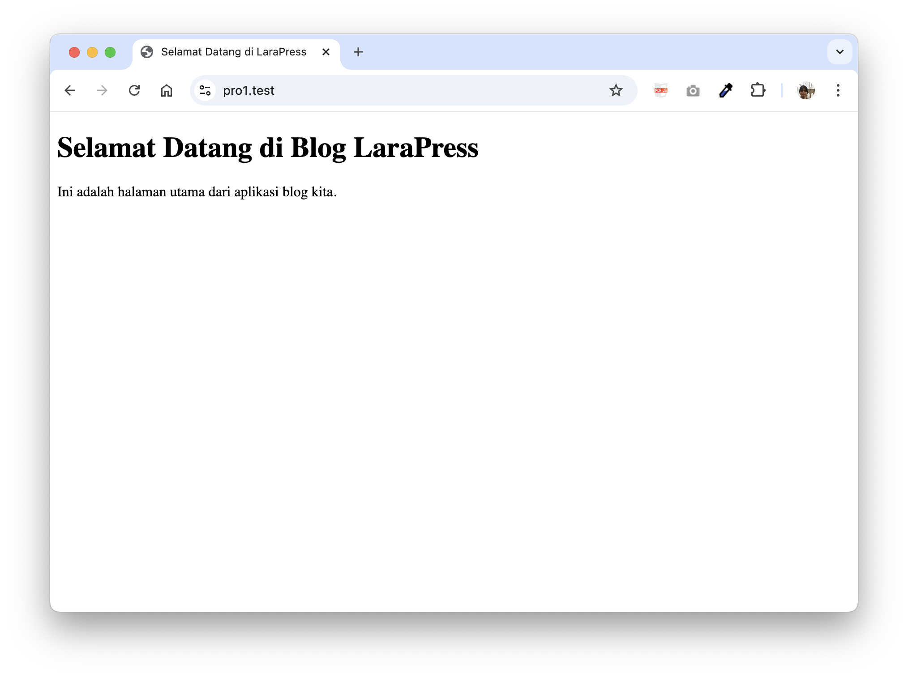

# LaraPress - Aplikasi Blog Sederhana

LaraPress adalah aplikasi blog sederhana yang dibangun menggunakan Laravel 12 untuk tujuan pembelajaran dan pengembangan keterampilan web development.

## 📋 Tentang Proyek

Proyek ini dibuat sebagai bagian dari pembelajaran Laravel framework. LaraPress mendemonstrasikan konsep-konsep dasar Laravel seperti routing, views, dan struktur MVC.

## 🚀 Fitur yang Sudah Diimplementasikan

### 1. **Full-Filament Application** ⭐ NEW
   - Semua halaman dirender menggunakan Filament Panel
   - Custom header konsisten di semua halaman
   - Dashboard dengan real-time widgets
   - Unified authentication system

### 2. **Sistem Autentikasi**
   - Login dan Registrasi (Filament Auth)
   - Profile Management
   - Password hashing & CSRF protection
   - Session security & rate limiting

### 3. **Halaman Publik**
   - Halaman Utama: Custom Filament Page dengan hero section
   - Features showcase
   - Call-to-Action untuk registrasi
   - Responsive design dengan Tailwind CSS

## � Dokumentasi Praktikum

Proyek ini dikembangkan melalui serangkaian praktikum:

| Praktikum | Topik | Dokumentasi | Status |
|-----------|-------|-------------|--------|
| **Praktikum 1** | Views & Routing | [� Praktikum1.md](docs/Praktikum1.md) | ✅ Selesai |
| **Praktikum 2** | Authentication (Breeze) | [📄 Praktikum2.md](docs/Praktikum2.md) | ✅ Selesai |
| **Praktikum 3** | Full-Filament Migration | [📄 Praktikum3.md](docs/Praktikum3.md) | ✅ Selesai |
| **Praktikum 4** | CRUD Posts & Categories | Coming Soon | 🚧 Planned |

## 🌐 Endpoint yang Tersedia

| Route | Method | Deskripsi | Auth Required |
|-------|--------|-----------|---------------|
| `/` | GET | Halaman utama (Filament Custom Page) | ❌ |
| `/login` | GET/POST | Halaman login Filament | ❌ |
| `/register` | GET/POST | Halaman registrasi Filament | ❌ |
| `/dashboard` | GET | Dashboard dengan widgets | ✅ |
| `/profile` | GET/POST | Profile management | ✅ |

## 💻 Teknologi yang Digunakan

### Backend
- **Framework**: Laravel 12
- **PHP Version**: 8.x
- **Database**: SQLite (development)
- **Admin Panel**: Filament 3.3

### Frontend (TALL Stack)
- **T**ailwind CSS - Utility-first CSS framework
- **A**lpine.js - Lightweight JavaScript framework
- **L**ivewire - Full-stack framework for Laravel
- **L**aravel - PHP framework

### Tools
- **Build Tool**: Vite
- **Package Manager**: Composer & NPM
- **Version Control**: Git

## 📦 Instalasi

1. Clone repository ini:
```bash
git clone https://github.com/adiwp/pbw.git
cd pro1
```

2. Install dependencies:
```bash
composer install
npm install
```

3. Buat file `.env`:
```bash
cp .env.example .env
```

4. Generate application key:
```bash
php artisan key:generate
```

5. Jalankan development server:
```bash
php artisan serve
```

6. Akses aplikasi di browser:
```
http://localhost:8000
```

## 📸 Screenshot

### Halaman Utama


Halaman utama menampilkan sambutan sederhana kepada pengunjung blog LaraPress.

## 🔄 Git History

Semua perubahan telah di-commit dan di-push ke repository dengan pesan commit yang jelas mengenai setiap modifikasi yang dilakukan.

## � Default User Accounts

Untuk testing, gunakan kredensial berikut:

### Admin Account
- **Email**: `admin1@larapress.test`
- **Password**: `password123`
- **Role**: Administrator

### Test User (jika sudah register)
- **Email**: `user@larapress.test`
- **Password**: `password123`
- **Role**: User

> ⚠️ **Catatan**: Ganti password default untuk production!

---

## 📝 Rencana Pengembangan

- [x] ✅ Sistem autentikasi (Filament Auth)
- [x] ✅ Dashboard dengan widgets
- [x] ✅ Profile management
- [x] ✅ Custom header konsisten
- [ ] 🚧 CRUD Posts (Artikel blog)
- [ ] 🚧 CRUD Categories
- [ ] 📋 Sistem komentar
- [ ] 📋 Media upload untuk featured images
- [ ] 📋 Search & filtering
- [ ] 📋 Tags system

## 👨‍💻 Pengembang

- **Nama**: Adi Wahyu
- **Repository**: [pbw](https://github.com/adiwp/pbw)
- **Branch**: main

## 📄 Lisensi

Proyek ini menggunakan lisensi MIT - lihat file LICENSE untuk detail lebih lanjut.

---

**Catatan**: Proyek ini dibuat untuk tujuan pembelajaran. Jangan ragu untuk melakukan fork dan modifikasi sesuai kebutuhan Anda!

## Code of Conduct

In order to ensure that the Laravel community is welcoming to all, please review and abide by the [Code of Conduct](https://laravel.com/docs/contributions#code-of-conduct).

## Security Vulnerabilities

If you discover a security vulnerability within Laravel, please send an e-mail to Taylor Otwell via [taylor@laravel.com](mailto:taylor@laravel.com). All security vulnerabilities will be promptly addressed.

## License
