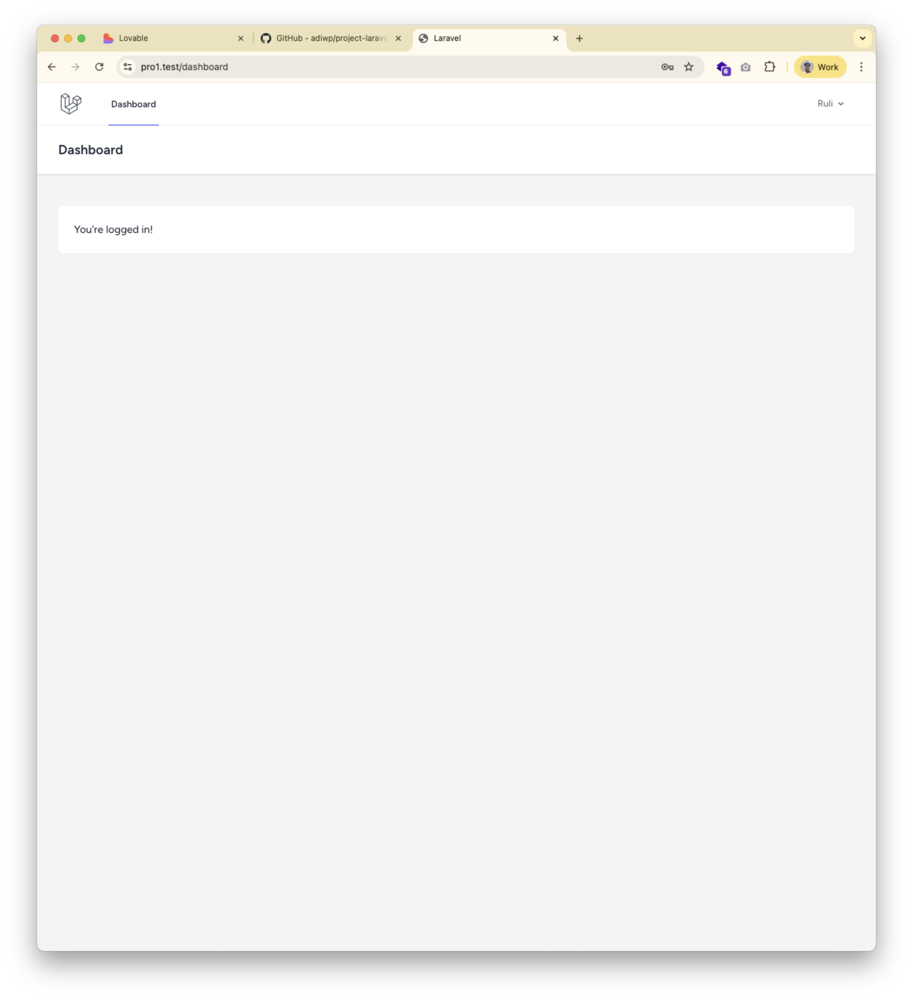

# LaraPress - Aplikasi Blog Sederhana

LaraPress adalah aplikasi blog sederhana yang dibangun menggunakan Laravel 12 untuk tujuan pembelajaran dan pengembangan keterampilan web development.


*Tampilan halaman utama LaraPress*

## 📋 Tentang Proyek

Proyek ini dibuat sebagai bagian dari pembelajaran Laravel framework. LaraPress mendemonstrasikan konsep-konsep dasar Laravel seperti routing, views, dan struktur MVC.

## 🚀 Fitur yang Sudah Diimplementasikan

### 1. **Halaman Utama (Welcome Page)**
   - Mengubah tampilan default Laravel menjadi halaman sederhana
   - Menampilkan judul "Selamat Datang di LaraPress"
   - Struktur HTML yang bersih dan minimal

### 2. **Halaman Tentang Kami**
   - Route: `/tentang-kami`
   - Menampilkan informasi tentang LaraPress
   - Menjelaskan tujuan proyek sebagai pembelajaran Laravel 12

### 3. **Sistem Autentikasi (Laravel Breeze)** ✨ BARU
   - **Login & Registrasi**: Pengguna dapat membuat akun dan login
   - **Profile Management**: Pengguna dapat mengedit profil mereka
   - **Password Reset**: Fitur lupa password via email
   - **Email Verification**: Verifikasi email pengguna
   - **Session Management**: Sistem session yang aman
   - **Dashboard**: Halaman dashboard untuk pengguna yang sudah login
   - **Middleware Protection**: Route yang dilindungi autentikasi

## 📁 Struktur File yang Dimodifikasi

### File yang Dibuat/Dimodifikasi:

1. **`resources/views/welcome.blade.php`**
   - Mengubah tampilan default Laravel yang kompleks menjadi struktur HTML sederhana
   - Menampilkan pesan sambutan untuk pengunjung blog

2. **`resources/views/about.blade.php`** (BARU)
   - File view baru untuk halaman "Tentang Kami"
   - Berisi informasi tentang LaraPress sebagai proyek pembelajaran

3. **`routes/web.php`**
   - Menambahkan route baru `/tentang-kami` yang mengarah ke view `about.blade.php`

## 🛠️ Langkah-langkah Implementasi

---

## 📚 Pertemuan 7: Implementasi Sistem Autentikasi dengan Laravel Breeze

### 🎯 Tujuan Pembelajaran
Pada pertemuan ini, kita belajar tentang:
1. Konsep fundamental sistem autentikasi web
2. Alur kerja login dan peran session
3. Keamanan password dengan hashing
4. Implementasi Laravel Breeze
5. Middleware untuk proteksi route

### 🔐 Konsep Autentikasi

#### Apa itu Autentikasi?
**Autentikasi** adalah proses verifikasi identitas pengguna. Ini menjawab pertanyaan "Siapa Anda?".

**Analogi**: Seperti menunjukkan KTP di gerbang masuk kampus - satpam memverifikasi bahwa Anda adalah orang yang sah.

#### Perbedaan Autentikasi vs Otorisasi
- **Autentikasi**: Memverifikasi identitas ("Siapa Anda?")
- **Otorisasi**: Menentukan hak akses ("Apa yang boleh Anda lakukan?")

#### Alur Kerja Login
1. **Pengguna mengirim kredensial**: Email dan password di form login
2. **Aplikasi mencari pengguna**: Cek database apakah email terdaftar
3. **Verifikasi password**: 
   - Password yang diinput di-hash dengan algoritma yang sama
   - Hash dibandingkan dengan hash di database
   - TIDAK PERNAH membandingkan password asli
4. **Autentikasi berhasil**: Jika hash cocok, identitas terverifikasi
5. **Aplikasi "mengingat"**: Session dan Cookie dibuat untuk request selanjutnya

#### Keamanan Password: Hashing
**Hashing** adalah proses satu arah mengubah password menjadi karakter acak.

**Analogi**: Seperti menggiling daging menjadi sosis - mudah mengubah daging jadi sosis, tapi tidak bisa mengubah sosis kembali jadi daging.

Laravel menggunakan algoritma kuat (Bcrypt/Argon2). Jadi meskipun database bocor, password asli tetap aman!

#### Peran Cookies & Sessions
**Analogi Stempel Konser**:
- Saat masuk konser, Anda tunjukkan tiket (login dengan password)
- Petugas beri Anda stempel di tangan (Cookie)
- Selanjutnya, cukup tunjukkan stempel tanpa perlu tiket lagi

**Alur Teknis**:
1. Setelah login, Laravel membuat **Session** di server dengan data pengguna
2. Laravel mengirim ID session ke browser dalam bentuk **Cookie**
3. Setiap request, browser kirim cookie tersebut
4. Laravel cocokkan ID di cookie dengan session di server
5. Laravel tahu "Ah, ini si Budi yang tadi login!"

### 📦 Instalasi Laravel Breeze

#### Langkah 1: Install Package Breeze
```bash
composer require laravel/breeze --dev
```

#### Langkah 2: Install Scaffolding Breeze
```bash
php artisan breeze:install blade --pest
```
Perintah ini akan:
- Membuat semua Controller autentikasi
- Membuat semua View (login, register, dll)
- Membuat route autentikasi
- Install Tailwind CSS
- Setup testing dengan Pest

#### Langkah 3: Install Dependencies Frontend
```bash
npm install
```

#### Langkah 4: Compile Assets
```bash
npm run dev
```

#### Langkah 5: Jalankan Migrasi
```bash
php artisan migrate
```
Migrasi ini menambahkan:
- Kolom `remember_token` ke tabel `users`
- Tabel `password_reset_tokens`
- Tabel `sessions`

### 📂 File yang Ditambahkan oleh Breeze

#### Controllers Autentikasi
Lokasi: `app/Http/Controllers/Auth/`
- `AuthenticatedSessionController.php` - Mengatur login/logout
- `RegisteredUserController.php` - Mengatur registrasi
- `PasswordResetLinkController.php` - Mengatur lupa password
- `NewPasswordController.php` - Mengatur reset password
- `EmailVerificationNotificationController.php` - Verifikasi email
- `PasswordController.php` - Update password
- `ConfirmablePasswordController.php` - Konfirmasi password

#### Views Autentikasi
Lokasi: `resources/views/auth/`
- `login.blade.php` - Form login
- `register.blade.php` - Form registrasi
- `forgot-password.blade.php` - Form lupa password
- `reset-password.blade.php` - Form reset password
- `verify-email.blade.php` - Halaman verifikasi email
- `confirm-password.blade.php` - Form konfirmasi password

#### Layouts & Components
Lokasi: `resources/views/layouts/`
- `app.blade.php` - Layout utama aplikasi
- `guest.blade.php` - Layout untuk guest (belum login)
- `navigation.blade.php` - Navigasi header

#### Route Autentikasi
File: `routes/auth.php` - Berisi semua route autentikasi

### 🔒 Mengamankan Route dengan Middleware

#### Apa itu Middleware?
Middleware adalah "penjaga" yang memeriksa request sebelum mencapai controller.

**Middleware `auth`**: Memastikan pengguna sudah login sebelum mengakses route tertentu.

#### Cara Menggunakan Middleware Auth

**Opsi 1: Single Route**
```php
Route::get('/dashboard', function () {
    return view('dashboard');
})->middleware('auth');
```

**Opsi 2: Route Group (Lebih Efisien)**
```php
Route::middleware('auth')->group(function () {
    Route::get('/dashboard', [DashboardController::class, 'index']);
    Route::get('/profile', [ProfileController::class, 'edit']);
    Route::post('/posts', [PostController::class, 'store']);
});
```

#### Contoh Implementasi di LaraPress
```php
// Halaman Publik (tidak perlu login)
Route::get('/', function () {
    return view('welcome');
})->name('home');

Route::get('/tentang-kami', function () {
    return view('about');
})->name('about');

// Halaman yang Memerlukan Login
Route::middleware('auth')->group(function () {
    Route::get('/dashboard', function () {
        return view('dashboard');
    })->name('dashboard');
    
    Route::get('/profile', [ProfileController::class, 'edit'])->name('profile.edit');
    Route::patch('/profile', [ProfileController::class, 'update'])->name('profile.update');
});
```

### 🧪 Testing Autentikasi

#### Uji Coba 1: Registrasi
1. Jalankan server: `php artisan serve`
2. Buka browser: `http://localhost:8000`
3. Klik tombol "Register" di pojok kanan atas
4. Isi form registrasi dengan data valid
5. Klik "Register"
6. Anda akan diarahkan ke Dashboard

#### Uji Coba 2: Login
1. Klik "Logout" di navigation
2. Klik "Login"
3. Masukkan email dan password yang tadi didaftarkan
4. Klik "Login"
5. Anda akan masuk ke Dashboard

#### Uji Coba 3: Proteksi Route
1. Logout dari aplikasi
2. Coba akses langsung: `http://localhost:8000/dashboard`
3. Anda akan otomatis diarahkan ke halaman login!
4. Ini membuktikan middleware `auth` bekerja dengan baik

### 📊 Alur Data Autentikasi

```
┌─────────────┐
│   Browser   │
│  (Pengguna) │
└──────┬──────┘
       │ 1. Submit email & password
       ▼
┌─────────────────────────────────┐
│      Laravel Application        │
│                                 │
│  2. AuthenticatedSession        │
│     Controller menerima data    │
│                                 │
│  3. Cari user berdasarkan email │
│     di database                 │
│                                 │
│  4. Hash password input         │
│                                 │
│  5. Bandingkan hash dengan DB   │
│                                 │
│  6. Jika cocok:                 │
│     - Buat Session              │
│     - Kirim Cookie ke Browser   │
│                                 │
│  7. Redirect ke Dashboard       │
└──────┬──────────────────────────┘
       │ 8. Cookie disimpan
       ▼
┌─────────────┐
│   Browser   │
│  (Logged In)│
└─────────────┘
```

### 🔑 Konsep Penting Laravel Breeze

#### 1. CSRF Protection
Setiap form di Laravel Breeze memiliki `@csrf` token:
```blade
<form method="POST" action="{{ route('login') }}">
    @csrf
    <!-- form fields -->
</form>
```
Ini melindungi dari serangan Cross-Site Request Forgery.

#### 2. Password Hashing Otomatis
Saat registrasi, password otomatis di-hash:
```php
'password' => Hash::make($request->password)
```

#### 3. Remember Me
Checkbox "Remember Me" menyimpan session lebih lama:
```blade
<input type="checkbox" name="remember" id="remember">
<label for="remember">Remember me</label>
```

#### 4. Email Verification (Opsional)
Route dengan middleware `verified` memerlukan email terverifikasi:
```php
Route::get('/dashboard', function () {
    return view('dashboard');
})->middleware(['auth', 'verified']);
```

### ✅ Checklist Setelah Instalasi Breeze

- [x] Package Breeze terinstal via Composer
- [x] Scaffolding Breeze terpasang (Controllers, Views, Routes)
- [x] Dependencies frontend terinstal (npm install)
- [x] Assets ter-compile (npm run dev)
- [x] Migrasi database berhasil
- [x] Dapat mengakses halaman `/register`
- [x] Dapat mengakses halaman `/login`
- [x] Dapat membuat akun baru
- [x] Dapat login dengan akun yang dibuat
- [x] Dashboard dapat diakses setelah login
- [x] Tidak dapat akses dashboard tanpa login
- [x] Dapat logout dengan sukses

### 🎓 Pembelajaran Penting

1. **Keamanan adalah Prioritas**: Laravel Breeze menggunakan praktik terbaik untuk keamanan
2. **Jangan Reinvent the Wheel**: Gunakan package yang sudah teruji seperti Breeze
3. **Pahami Kode yang Dihasilkan**: Jangan hanya copy-paste, baca dan pahami
4. **Middleware adalah Powerful**: Gunakan untuk proteksi route dengan mudah
5. **Session Management Otomatis**: Laravel menangani session secara otomatis

---

### Step 1: Modifikasi Halaman Welcome (Pertemuan Awal)
Mengubah file `resources/views/welcome.blade.php` dari tampilan default Laravel (266 baris) menjadi HTML sederhana:

```html
<!DOCTYPE html>
<html lang="id">
<head>
    <meta charset="UTF-8">
    <meta name="viewport" content="width=device-width, initial-scale=1.0">
    <title>Selamat Datang di LaraPress</title>
</head>
<body>
    <h1>Selamat Datang di Blog LaraPress</h1>
    <p>Ini adalah halaman utama dari aplikasi blog kita.</p>
</body>
</html>
```

### Step 2: Membuat Route Baru
Menambahkan route baru di `routes/web.php`:

```php
Route::get('/tentang-kami', function () {
    return view('about');
});
```

### Step 3: Membuat View About
Membuat file baru `resources/views/about.blade.php`:

```html
<!DOCTYPE html>
<html lang="id">
<head>
    <meta charset="UTF-8">
    <meta name="viewport" content="width=device-width, initial-scale=1.0">
    <title>Tentang Kami - LaraPress</title>
</head>
<body>
    <h1>Tentang LaraPress</h1>
    <p>LaraPress adalah aplikasi blog sederhana yang dibuat dengan Laravel 12.</p>
    <p>Proyek ini dibuat untuk tujuan pembelajaran dan pengembangan keterampilan.</p>
</body>
</html>
```

## 🌐 Endpoint yang Tersedia

### Halaman Publik (Tidak Perlu Login)
| Route | Method | Deskripsi |
|-------|--------|-----------|
| `/` | GET | Halaman utama LaraPress |
| `/tentang-kami` | GET | Halaman tentang LaraPress |
| `/login` | GET, POST | Halaman login pengguna |
| `/register` | GET, POST | Halaman registrasi pengguna baru |
| `/forgot-password` | GET, POST | Halaman lupa password |
| `/reset-password/{token}` | GET, POST | Halaman reset password |

### Halaman yang Memerlukan Autentikasi
| Route | Method | Deskripsi |
|-------|--------|-----------|
| `/dashboard` | GET | Dashboard pengguna |
| `/profile` | GET | Halaman edit profil |
| `/profile` | PATCH | Update profil pengguna |
| `/profile` | DELETE | Hapus akun pengguna |
| `/logout` | POST | Logout pengguna |
| `/verify-email` | GET | Notifikasi verifikasi email |
| `/confirm-password` | GET, POST | Konfirmasi password untuk aksi sensitif |

## 💻 Teknologi yang Digunakan

- **Framework**: Laravel 12
- **PHP Version**: 8.x
- **Database**: SQLite (default)
- **Frontend**: Blade Template Engine, Tailwind CSS, Alpine.js
- **Build Tool**: Vite
- **Autentikasi**: Laravel Breeze
- **Testing**: Pest PHP

## 📦 Instalasi

1. Clone repository ini:
```bash
git clone https://github.com/adiwp/pbw.git
cd pro1
```

2. Install dependencies:
```bash
composer install
npm install
```

3. Buat file `.env`:
```bash
cp .env.example .env
```

4. Generate application key:
```bash
php artisan key:generate
```

5. Jalankan migrasi database:
```bash
php artisan migrate
```

6. (Opsional) Seed data user default:
```bash
php artisan db:seed --class=UserSeeder
```

7. Compile assets:
```bash
npm run dev
```

8. Jalankan development server:
```bash
php artisan serve
```

9. Akses aplikasi di browser:
```
http://localhost:8000
```

## 🔑 Akun Default

Untuk testing dan development, gunakan kredensial berikut:

### Admin
- **Email**: `admin@larapress.test`
- **Password**: `password123`

### User Demo
- **Email**: `user@larapress.test`
- **Password**: `password123`

> **⚠️ Catatan Keamanan**: Kredensial ini hanya untuk development. Gunakan password yang kuat di production!

## 📸 Screenshot

### Halaman Utama


Halaman utama menampilkan sambutan sederhana kepada pengunjung blog LaraPress.

### Halaman Autentikasi

#### Registrasi User Baru

*Form registrasi untuk user baru dengan validasi lengkap*

#### Login

*Form login dengan opsi "Remember Me"*

#### Dashboard Setelah Login

*Dashboard yang muncul setelah berhasil login*

#### Profile Management

*Halaman untuk mengelola profil pengguna*

> **📖 Dokumentasi Lengkap**: Lihat [ITERASI-autentikasi.md](docs/ITERASI-autentikasi.md) untuk dokumentasi detail implementasi autentikasi.

## 🔄 Git History

Semua perubahan telah di-commit dan di-push ke repository dengan pesan commit yang jelas mengenai setiap modifikasi yang dilakukan.

## 📝 Rencana Pengembangan

- [x] Menambahkan sistem autentikasi ✅ **SELESAI**
- [x] Menambahkan styling dengan Tailwind CSS ✅ **SELESAI**
- [ ] Membuat fitur CRUD untuk artikel blog
- [ ] Menambahkan sistem komentar
- [ ] Implementasi kategori dan tag
- [ ] Membuat dashboard admin
- [ ] Implementasi search functionality
- [ ] Upload gambar untuk artikel
- [ ] Implementasi rich text editor
- [ ] Membuat sistem otorisasi (roles & permissions)

## 👨‍💻 Pengembang

- **Nama**: Adi Wahyu
- **Repository**: [pbw](https://github.com/adiwp/pbw)
- **Branch**: main

## 📄 Lisensi

Proyek ini menggunakan lisensi MIT - lihat file LICENSE untuk detail lebih lanjut.

---

**Catatan**: Proyek ini dibuat untuk tujuan pembelajaran. Jangan ragu untuk melakukan fork dan modifikasi sesuai kebutuhan Anda!

## Code of Conduct

In order to ensure that the Laravel community is welcoming to all, please review and abide by the [Code of Conduct](https://laravel.com/docs/contributions#code-of-conduct).

## Security Vulnerabilities

If you discover a security vulnerability within Laravel, please send an e-mail to Taylor Otwell via [taylor@laravel.com](mailto:taylor@laravel.com). All security vulnerabilities will be promptly addressed.

## License

The Laravel framework is open-sourced software licensed under the [MIT license](https://opensource.org/licenses/MIT).
