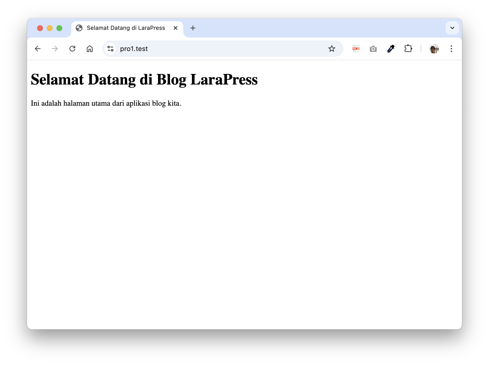

# Praktikum 1: Views & Routing Dasar

**Tanggal:** Oktober 2025  
**Materi:** Implementasi Views dan Routing di Laravel  
**Status:** ✅ Selesai

---

## 🎯 Tujuan Pembelajaran

Setelah menyelesaikan praktikum ini, mahasiswa diharapkan mampu:
1. Memahami konsep routing di Laravel
2. Membuat dan memodifikasi Blade views
3. Menghubungkan route dengan view
4. Memahami struktur dasar aplikasi Laravel

---

## 📋 Deskripsi

Pada praktikum pertama ini, kita akan membuat dua halaman sederhana:
1. **Halaman Utama** - Menampilkan sambutan "Selamat Datang di LaraPress"
2. **Halaman Tentang Kami** - Menampilkan informasi tentang LaraPress

---

## 🛠️ Langkah-langkah Implementasi

### Langkah 1: Modifikasi Halaman Welcome

File yang dimodifikasi: `resources/views/welcome.blade.php`

Ubah dari tampilan default Laravel menjadi HTML sederhana:

```html
<!DOCTYPE html>
<html lang="id">
<head>
    <meta charset="UTF-8">
    <meta name="viewport" content="width=device-width, initial-scale=1.0">
    <title>Selamat Datang di LaraPress</title>
</head>
<body>
    <h1>Selamat Datang di Blog LaraPress</h1>
    <p>Ini adalah halaman utama dari aplikasi blog kita.</p>
</body>
</html>
```

**Penjelasan:**
- Struktur HTML5 yang valid
- Meta viewport untuk responsive design
- Title yang deskriptif
- Konten sederhana dan jelas

---

### Langkah 2: Membuat Halaman Tentang Kami

File baru: `resources/views/about.blade.php`

```html
<!DOCTYPE html>
<html lang="id">
<head>
    <meta charset="UTF-8">
    <meta name="viewport" content="width=device-width, initial-scale=1.0">
    <title>Tentang Kami - LaraPress</title>
</head>
<body>
    <h1>Tentang LaraPress</h1>
    <p>LaraPress adalah aplikasi blog sederhana yang dibuat dengan Laravel 12.</p>
    <p>Proyek ini dibuat untuk tujuan pembelajaran dan pengembangan keterampilan.</p>
</body>
</html>
```

**Penjelasan:**
- Struktur yang konsisten dengan welcome.blade.php
- Title yang spesifik untuk halaman About
- Konten informatif tentang proyek

---

### Langkah 3: Membuat Routes

File yang dimodifikasi: `routes/web.php`

```php
<?php

use Illuminate\Support\Facades\Route;

// Route untuk halaman utama
Route::get('/', function () {
    return view('welcome');
});

// Route untuk halaman tentang kami
Route::get('/tentang-kami', function () {
    return view('about');
});
```

**Penjelasan:**
- `Route::get()` mendefinisikan route dengan HTTP method GET
- Parameter pertama adalah URI path
- Closure function mengembalikan view dengan `return view()`
- View name tanpa ekstensi `.blade.php`

---

## 📂 File yang Dibuat/Dimodifikasi

| File | Status | Deskripsi |
|------|--------|-----------|
| `resources/views/welcome.blade.php` | ✏️ Dimodifikasi | Halaman utama |
| `resources/views/about.blade.php` | ✨ Baru | Halaman tentang kami |
| `routes/web.php` | ✏️ Dimodifikasi | Menambahkan route `/tentang-kami` |

---

## 🌐 Routes yang Tersedia

| Route | Method | View | Deskripsi |
|-------|--------|------|-----------|
| `/` | GET | welcome.blade.php | Halaman utama LaraPress |
| `/tentang-kami` | GET | about.blade.php | Halaman tentang LaraPress |

---

## 🧪 Testing

### Test 1: Halaman Utama
1. Jalankan server: `php artisan serve`
2. Buka browser: `http://localhost:8000`
3. **Expected:** Muncul halaman dengan teks "Selamat Datang di Blog LaraPress"
4. **Result:** ✅ Berhasil

### Test 2: Halaman Tentang Kami
1. Buka browser: `http://localhost:8000/tentang-kami`
2. **Expected:** Muncul halaman dengan informasi tentang LaraPress
3. **Result:** ✅ Berhasil

---

## 📸 Screenshot

### Halaman Utama

*Tampilan halaman utama LaraPress*

---

## 🎓 Konsep Laravel yang Dipelajari

### 1. Routing

**Definisi:** Routing adalah proses menentukan bagaimana aplikasi merespons request dari client ke URI tertentu.

**Sintaks Dasar:**
```php
Route::get('/path', function () {
    return view('viewname');
});
```

**Komponen:**
- `Route::` - Facade untuk mengakses router
- `get()` - HTTP method (GET, POST, PUT, DELETE, dll)
- `/path` - URI yang akan diakses
- `function()` - Closure atau Controller method
- `view()` - Helper untuk mengembalikan view

---

### 2. Views (Blade Template)

**Definisi:** Views adalah file yang berisi HTML yang akan ditampilkan ke user.

**Lokasi:** `resources/views/`

**Ekstensi:** `.blade.php`

**Cara Memanggil:**
```php
return view('welcome');        // resources/views/welcome.blade.php
return view('about');          // resources/views/about.blade.php
return view('folder.file');    // resources/views/folder/file.blade.php
```

---

### 3. Blade Template Engine

**Keunggulan:**
- Sintaks yang sederhana dan mudah dibaca
- Tidak menambah overhead, karena di-compile menjadi PHP biasa
- Mendukung inheritance dan sections
- Dapat menggunakan PHP code biasa

**Contoh Penggunaan Dasar:**
```blade
{{-- Komentar --}}
{{ $variable }}              {{-- Echo variable --}}
@if($condition)              {{-- Control structures --}}
    <!-- content -->
@endif
```

---

### 4. MVC Pattern

Pada praktikum ini, kita baru implementasi:
- **Model:** Belum (praktikum selanjutnya)
- **View:** ✅ welcome.blade.php, about.blade.php
- **Controller:** Belum (masih menggunakan closure di route)

---

## 🔄 Alur Request-Response

```
┌─────────────┐
│   Browser   │  User mengakses http://localhost:8000/
│  (Client)   │
└──────┬──────┘
       │ 1. HTTP GET Request
       ▼
┌─────────────────────────────┐
│    Laravel Application      │
│                             │
│  2. Router (web.php)        │
│     Cek: apakah ada route   │
│     yang match dengan "/"?  │
│                             │
│  3. Route ditemukan!        │
│     Execute closure:        │
│     return view('welcome')  │
│                             │
│  4. Blade Engine            │
│     Load & compile          │
│     welcome.blade.php       │
│                             │
│  5. Generate HTML           │
└──────┬──────────────────────┘
       │ 6. HTTP Response (HTML)
       ▼
┌─────────────┐
│   Browser   │  Tampilkan halaman
│  (Display)  │
└─────────────┘
```

---

## ✅ Checklist Praktikum

### Setup & Instalasi
- [x] Laravel terinstall
- [x] Server berjalan dengan `php artisan serve`
- [x] Git repository initialized

### Implementasi Views
- [x] Modifikasi `welcome.blade.php`
- [x] Buat `about.blade.php`
- [x] Struktur HTML yang valid
- [x] Konten yang sesuai

### Implementasi Routes
- [x] Route `/` untuk halaman utama
- [x] Route `/tentang-kami` untuk halaman about
- [x] Route berfungsi dengan baik

### Testing
- [x] Halaman utama dapat diakses
- [x] Halaman tentang kami dapat diakses
- [x] Tidak ada error
- [x] Screenshot diambil

### Dokumentasi
- [x] Dokumentasi langkah-langkah
- [x] Screenshot halaman
- [x] Kode terdokumentasi

---

## 💡 Tips & Best Practices

### 1. Penamaan Route
```php
// ❌ Hindari
Route::get('/aboutUs', ...);
Route::get('/about_us', ...);

// ✅ Gunakan kebab-case
Route::get('/about-us', ...);
Route::get('/tentang-kami', ...);
```

### 2. Penamaan View
```php
// ❌ Hindari
return view('aboutPage');

// ✅ Gunakan lowercase dengan underscore/dash
return view('about');
return view('about_page');
```

### 3. Organisasi File
```
resources/views/
├── welcome.blade.php         ← Halaman utama
├── about.blade.php          ← Halaman about
├── layouts/                 ← Layout templates (nanti)
├── components/              ← Reusable components (nanti)
└── partials/                ← Partial views (nanti)
```

---

## 🚀 Pengembangan Selanjutnya

### Praktikum 2: Autentikasi
- [ ] Install Laravel Breeze
- [ ] Implementasi login & register
- [ ] Profile management
- [ ] Middleware protection

### Peningkatan Views (Opsional)
- [ ] Tambahkan layout master
- [ ] Buat navigation component
- [ ] Tambahkan CSS styling
- [ ] Responsive design

---

## 📚 Referensi

### Dokumentasi Official
- [Laravel Routing](https://laravel.com/docs/12.x/routing)
- [Laravel Views](https://laravel.com/docs/12.x/views)
- [Blade Templates](https://laravel.com/docs/12.x/blade)

### Tutorial & Learning
- [Laracasts - Laravel From Scratch](https://laracasts.com/series/laravel-from-scratch)
- [Laravel Daily](https://laraveldaily.com)

---

## ❓ FAQ

**Q: Kenapa view file extension nya `.blade.php` bukan `.php` saja?**  
A: `.blade.php` menandakan bahwa file tersebut menggunakan Blade template engine. Laravel akan memprosesnya berbeda dengan file `.php` biasa.

**Q: Apakah bisa menggunakan PHP biasa di Blade?**  
A: Ya, bisa! Blade adalah superset dari PHP. Semua kode PHP valid di Blade.

**Q: Kenapa menggunakan closure di route, bukan controller?**  
A: Untuk hal sederhana, closure lebih praktis. Untuk logic yang kompleks, gunakan controller (akan dipelajari di praktikum selanjutnya).

---

## 🎯 Kesimpulan

Pada Praktikum 1 ini, kita telah berhasil:
1. ✅ Memahami konsep routing di Laravel
2. ✅ Membuat dan memodifikasi Blade views
3. ✅ Menghubungkan route dengan view
4. ✅ Menjalankan aplikasi Laravel pertama

**Status:** ✅ **SELESAI**  
**Next:** Praktikum 2 - Sistem Autentikasi dengan Laravel Breeze

---

*Dokumentasi ini adalah bagian dari pembelajaran Laravel untuk proyek LaraPress.*
