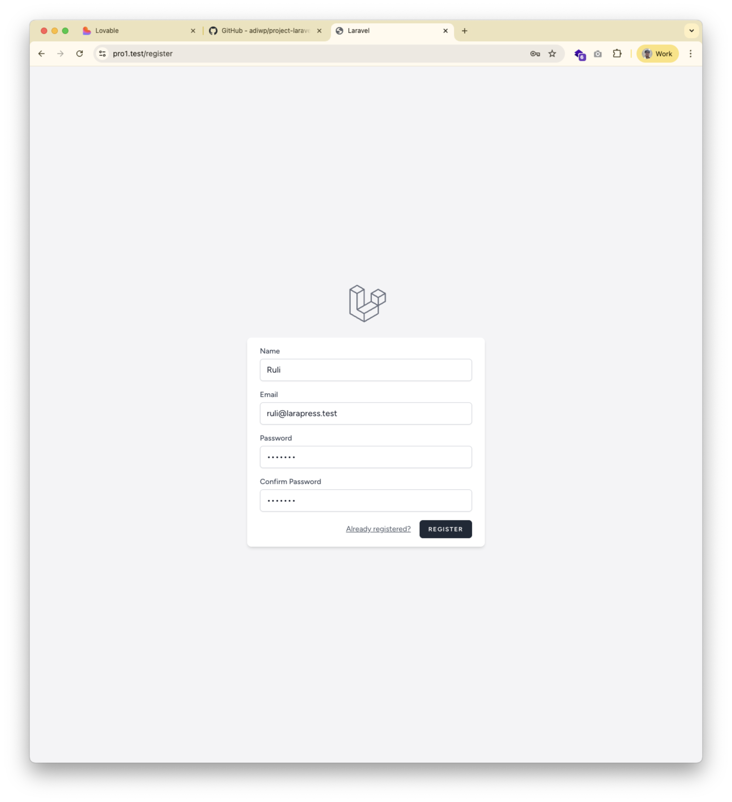
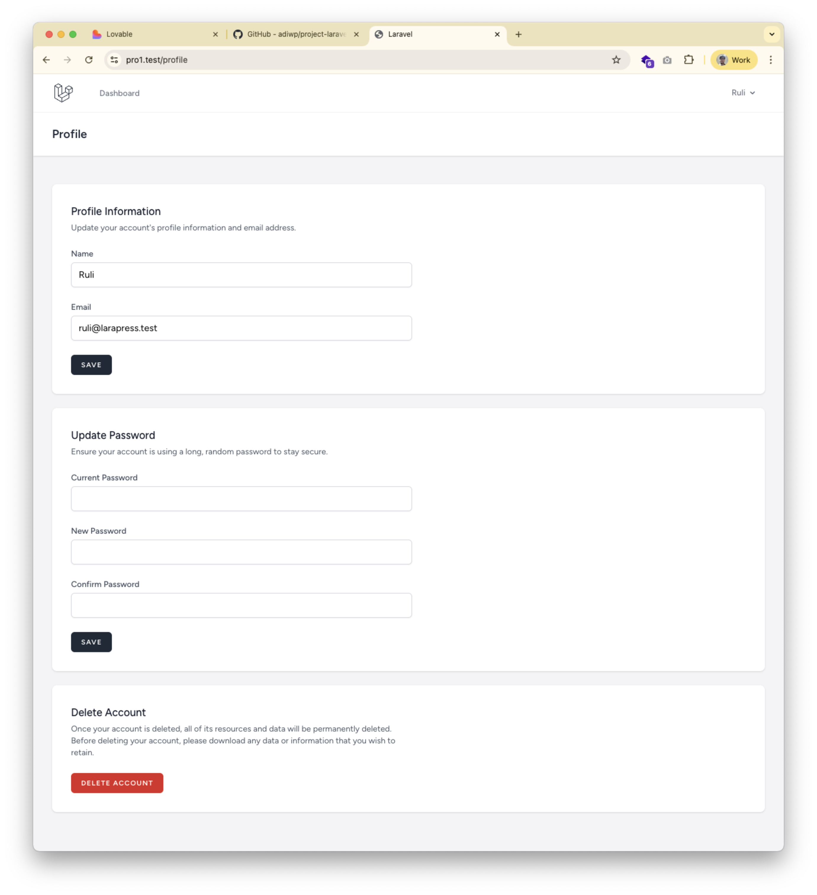

# Praktikum 2: Sistem Autentikasi dengan Laravel Breeze

**Tanggal:** 3 Oktober 2025  
**Materi:** Implementasi Autentikasi Pengguna  
**Status:** ✅ Selesai & Tested

---

## 🎯 Tujuan Pembelajaran

Setelah menyelesaikan praktikum ini, mahasiswa diharapkan mampu:
1. Memahami konsep autentikasi web
2. Menginstall dan mengkonfigurasi Laravel Breeze
3. Implementasi sistem login, register, dan logout
4. Melindungi route dengan middleware
5. Mengelola user profile

---

## 📋 Deskripsi

Pada praktikum ini, kita akan menambahkan fitur autentikasi lengkap menggunakan Laravel Breeze, termasuk:
- Registrasi pengguna baru
- Login & Logout
- Dashboard pengguna
- Profile management
- Password reset
- Email verification
- Session management

---

## 🔐 Konsep Autentikasi

### Apa itu Autentikasi?

**Autentikasi** adalah proses verifikasi identitas pengguna. Menjawab pertanyaan: **"Siapa Anda?"**

**Analogi:** Seperti menunjukkan KTP di gerbang kampus - satpam memverifikasi bahwa Anda adalah orang yang sah.

### Autentikasi vs Otorisasi

| Autentikasi | Otorisasi |
|-------------|-----------|
| "Siapa Anda?" | "Apa yang boleh Anda lakukan?" |
| Login dengan password | User role & permissions |
| Memverifikasi identitas | Mengontrol akses |

### Alur Kerja Login

```
1. User input email & password
   ↓
2. Aplikasi cari user berdasarkan email
   ↓
3. Hash password yang diinput
   ↓
4. Bandingkan hash dengan database
   ↓
5. Jika cocok → Buat session
   ↓
6. User berhasil login
```

### Password Hashing

**Kenapa password di-hash?**
- Password TIDAK disimpan dalam bentuk asli (plain text)
- Di-hash menggunakan algoritma satu arah (Bcrypt/Argon2)
- Meskipun database bocor, password tetap aman

**Analogi:** Seperti menggiling daging jadi sosis - mudah mengubah daging jadi sosis, tapi tidak bisa balik lagi.

### Session & Cookies

**Analogi Stempel Konser:**
- Login = Tunjukkan tiket di pintu masuk
- Cookie = Stempel di tangan Anda
- Selanjutnya = Cukup tunjukkan stempel, tidak perlu tiket lagi

---

## 🛠️ Langkah-langkah Implementasi

### Langkah 1: Install Laravel Breeze

```bash
composer require laravel/breeze --dev
```

**Penjelasan:** Install package Breeze sebagai development dependency.

---

### Langkah 2: Install Scaffolding Breeze

```bash
php artisan breeze:install blade --pest
```

**Pilihan:**
- Template: Blade with Alpine
- Testing: Pest

**Yang diinstall:**
- Controllers autentikasi
- Views (login, register, dll)
- Routes autentikasi
- Tailwind CSS
- Testing setup

---

### Langkah 3: Install Dependencies Frontend

```bash
npm install
```

**Penjelasan:** Install dependencies JavaScript yang dibutuhkan (Tailwind CSS, Alpine.js, dll).

---

### Langkah 4: Compile Assets

```bash
npm run dev
```

**Penjelasan:** Compile CSS dan JavaScript menggunakan Vite.

---

### Langkah 5: Jalankan Migrasi

```bash
php artisan migrate
```

**Yang ditambahkan ke database:**
- Tabel `users` (jika belum ada)
- Tabel `password_reset_tokens`
- Tabel `sessions`
- Kolom `remember_token` di tabel users

---

### Langkah 6: Buat User Seeder (Opsional)

File baru: `database/seeders/UserSeeder.php`

```php
<?php

namespace Database\Seeders;

use App\Models\User;
use Illuminate\Database\Seeder;
use Illuminate\Support\Facades\Hash;

class UserSeeder extends Seeder
{
    public function run(): void
    {
        // Admin User
        User::create([
            'name' => 'Admin LaraPress',
            'email' => 'admin@larapress.test',
            'password' => Hash::make('password123'),
            'email_verified_at' => now(),
        ]);

        // Demo User
        User::create([
            'name' => 'User Demo',
            'email' => 'user@larapress.test',
            'password' => Hash::make('password123'),
            'email_verified_at' => now(),
        ]);
    }
}
```

**Jalankan seeder:**
```bash
php artisan db:seed --class=UserSeeder
```

---

### Langkah 7: Update Routes (Menambahkan route lama)

File: `routes/web.php`

```php
<?php

use App\Http\Controllers\ProfileController;
use Illuminate\Support\Facades\Route;

// Halaman Publik
Route::get('/', function () {
    return view('welcome');
})->name('home');

Route::get('/tentang-kami', function () {
    return view('about');
})->name('about');

// Dashboard (perlu login)
Route::get('/dashboard', function () {
    return view('dashboard');
})->middleware(['auth', 'verified'])->name('dashboard');

// Profile Management (perlu login)
Route::middleware('auth')->group(function () {
    Route::get('/profile', [ProfileController::class, 'edit'])->name('profile.edit');
    Route::patch('/profile', [ProfileController::class, 'update'])->name('profile.update');
    Route::delete('/profile', [ProfileController::class, 'destroy'])->name('profile.destroy');
});

// Routes Autentikasi
require __DIR__.'/auth.php';
```

---

## 📂 File yang Ditambahkan oleh Breeze

### Controllers (9 files)
Lokasi: `app/Http/Controllers/Auth/`

| File | Fungsi |
|------|--------|
| `AuthenticatedSessionController.php` | Login & Logout |
| `RegisteredUserController.php` | Registrasi user baru |
| `PasswordResetLinkController.php` | Request reset password |
| `NewPasswordController.php` | Set password baru |
| `EmailVerificationNotificationController.php` | Kirim email verifikasi |
| `EmailVerificationPromptController.php` | Tampil notif verifikasi |
| `VerifyEmailController.php` | Verifikasi email |
| `PasswordController.php` | Update password |
| `ConfirmablePasswordController.php` | Konfirmasi password |

### Views (6 files)
Lokasi: `resources/views/auth/`

| File | Fungsi |
|------|--------|
| `login.blade.php` | Form login |
| `register.blade.php` | Form registrasi |
| `forgot-password.blade.php` | Form lupa password |
| `reset-password.blade.php` | Form reset password |
| `verify-email.blade.php` | Halaman verifikasi email |
| `confirm-password.blade.php` | Form konfirmasi password |

### Layouts & Components
- `resources/views/layouts/app.blade.php` - Layout utama
- `resources/views/layouts/guest.blade.php` - Layout untuk guest
- `resources/views/layouts/navigation.blade.php` - Navigation bar
- `resources/views/dashboard.blade.php` - Dashboard
- `resources/views/profile/edit.blade.php` - Edit profile

### Routes
- `routes/auth.php` - Semua route autentikasi

---

## 🌐 Routes Autentikasi

### Public Routes
| Route | Method | Deskripsi |
|-------|--------|-----------|
| `/login` | GET, POST | Halaman & proses login |
| `/register` | GET, POST | Halaman & proses registrasi |
| `/forgot-password` | GET, POST | Request link reset password |
| `/reset-password/{token}` | GET, POST | Reset password dengan token |

### Protected Routes (Perlu Login)
| Route | Method | Deskripsi |
|-------|--------|-----------|
| `/dashboard` | GET | Dashboard user |
| `/profile` | GET | Halaman edit profile |
| `/profile` | PATCH | Update profile |
| `/profile` | DELETE | Hapus akun |
| `/logout` | POST | Logout |
| `/verify-email` | GET | Notifikasi verifikasi email |
| `/confirm-password` | GET, POST | Konfirmasi password |

---

## 🔒 Middleware Protection

### Apa itu Middleware?

Middleware adalah "penjaga" yang memeriksa request sebelum mencapai controller.

**Analogi:** Satpam yang cek kartu akses sebelum Anda masuk gedung.

### Cara Menggunakan Middleware

**Single Route:**
```php
Route::get('/dashboard', function () {
    return view('dashboard');
})->middleware('auth');
```

**Route Group:**
```php
Route::middleware('auth')->group(function () {
    Route::get('/dashboard', [DashboardController::class, 'index']);
    Route::get('/profile', [ProfileController::class, 'edit']);
});
```

**Multiple Middleware:**
```php
Route::get('/dashboard', function () {
    return view('dashboard');
})->middleware(['auth', 'verified']);
```

---

## 🧪 Testing Manual

### Test 1: Registrasi User Baru
1. Akses: `http://localhost:8000/register`
2. Isi form dengan data valid
3. Klik tombol "Register"
4. **Expected:** Redirect ke dashboard
5. **Result:** ✅ **BERHASIL**



---

### Test 2: Login dengan Akun Default
1. Akses: `http://localhost:8000/login`
2. Email: `admin@larapress.test`
3. Password: `password123`
4. Klik "Login"
5. **Expected:** Redirect ke dashboard
6. **Result:** ✅ **BERHASIL**


---

### Test 3: Dashboard Bisa Diakses Setelah Login
1. Sudah login
2. Akses: `http://localhost:8000/dashboard`
3. **Expected:** Dashboard muncul dengan informasi user
4. **Result:** ✅ **BERHASIL**

---

### Test 4: Dashboard TIDAK Bisa Diakses Tanpa Login
1. Logout dulu
2. Akses: `http://localhost:8000/dashboard`
3. **Expected:** Redirect ke `/login`
4. **Result:** ✅ **BERHASIL** - Middleware bekerja!

---

### Test 5: Profile Management
1. Login
2. Akses: `http://localhost:8000/profile`
3. Edit nama atau email
4. Klik "Save"
5. **Expected:** Profile berhasil diupdate
6. **Result:** ✅ **BERHASIL**



---

### Test 6: Logout
1. Klik tombol "Logout" di navigation
2. **Expected:** Redirect ke halaman home, session dihapus
3. **Result:** ✅ **BERHASIL**

---

## 🎨 Fitur Breeze yang Tersedia

### 1. Autentikasi Dasar
- ✅ Registrasi pengguna baru
- ✅ Login dengan email & password
- ✅ Logout
- ✅ Remember Me functionality

### 2. Password Management
- ✅ Lupa password (kirim link via email)
- ✅ Reset password dengan token
- ✅ Update password di profile
- ✅ Konfirmasi password untuk aksi sensitif

### 3. Email Verification
- ✅ Kirim email verifikasi saat registrasi
- ✅ Verifikasi email dengan link
- ✅ Kirim ulang email verifikasi
- ✅ Middleware `verified` untuk route

### 4. Profile Management
- ✅ Edit profile (name, email)
- ✅ Update password
- ✅ Delete account

### 5. Session Management
- ✅ Session handling otomatis
- ✅ Cookie management
- ✅ CSRF protection

---

## 🔐 Fitur Keamanan

### 1. Password Hashing
```php
// Password di-hash sebelum disimpan
'password' => Hash::make($request->password)

// Verifikasi password
Hash::check($request->password, $user->password)
```

**Algoritma:** Bcrypt (default Laravel)

### 2. CSRF Protection
```blade
<form method="POST" action="{{ route('login') }}">
    @csrf  <!-- Token CSRF wajib -->
    <!-- form fields -->
</form>
```

### 3. Session Security
- Session ID di-regenerate setelah login
- HttpOnly cookies (tidak bisa diakses JavaScript)
- Secure cookies di production (HTTPS)

### 4. Rate Limiting
- Throttle di route login (anti brute force)
- Throttle di email verification
- Throttle di password reset

---

## 📊 Database Schema

### Tabel: users
| Column | Type | Description |
|--------|------|-------------|
| id | bigint | Primary key |
| name | string | Nama user |
| email | string | Email (unique) |
| email_verified_at | timestamp | Waktu verifikasi email |
| password | string | Password (hashed) |
| remember_token | string | Token untuk "Remember Me" |
| created_at | timestamp | Waktu dibuat |
| updated_at | timestamp | Waktu diupdate |

### Tabel: password_reset_tokens
| Column | Type | Description |
|--------|------|-------------|
| email | string | Email user |
| token | string | Token reset password |
| created_at | timestamp | Waktu dibuat |

### Tabel: sessions
| Column | Type | Description |
|--------|------|-------------|
| id | string | Session ID |
| user_id | bigint | ID user (nullable) |
| ip_address | string | IP address |
| user_agent | text | Browser info |
| payload | longtext | Session data |
| last_activity | integer | Waktu aktivitas terakhir |

---

## ✅ Checklist Praktikum

### Instalasi & Setup
- [x] Install Laravel Breeze
- [x] Install npm dependencies
- [x] Compile assets dengan Vite
- [x] Jalankan migrasi database
- [x] Buat UserSeeder
- [x] Seed akun default

### Konfigurasi
- [x] Update routes/web.php
- [x] Tambahkan route publik kembali
- [x] Pastikan route protected dengan middleware

### Testing Manual
- [x] Registrasi user baru berhasil
- [x] Login dengan akun default berhasil
- [x] Dashboard bisa diakses setelah login
- [x] Dashboard TIDAK bisa diakses tanpa login
- [x] Profile management berfungsi
- [x] Logout berhasil

### Dokumentasi
- [x] Screenshot semua halaman
- [x] Dokumentasi langkah-langkah
- [x] Hasil testing terdokumentasi

---

## 💡 Tips & Best Practices

### 1. Jangan Simpan Password Plain Text
```php
// ❌ SALAH - Bahaya!
'password' => $request->password

// ✅ BENAR - Aman!
'password' => Hash::make($request->password)
```

### 2. Gunakan Middleware untuk Proteksi
```php
// ✅ Proteksi route
Route::middleware('auth')->group(function () {
    // Routes yang perlu login
});
```

### 3. Selalu Gunakan CSRF Protection
```blade
<form method="POST">
    @csrf  <!-- WAJIB! -->
</form>
```

### 4. Validasi Input
```php
$request->validate([
    'email' => 'required|email',
    'password' => 'required|min:8',
]);
```

---

## 🚀 Pengembangan Selanjutnya

### Praktikum 3: CRUD Posts
- [ ] Membuat Model Post
- [ ] Migration tabel posts
- [ ] Controller untuk CRUD
- [ ] Views untuk manage posts
- [ ] Relasi User dan Post

### Peningkatan Autentikasi (Opsional)
- [ ] Social login (Google, GitHub)
- [ ] Two-factor authentication (2FA)
- [ ] Activity log
- [ ] Role & permissions

---

## 📚 Referensi

### Dokumentasi Official
- [Laravel Authentication](https://laravel.com/docs/12.x/authentication)
- [Laravel Breeze](https://laravel.com/docs/12.x/starter-kits#laravel-breeze)
- [Laravel Authorization](https://laravel.com/docs/12.x/authorization)

### Tutorial & Learning
- [Laracasts - Authentication](https://laracasts.com/series/laravel-authentication)
- [Laravel Daily - Breeze Tutorial](https://laraveldaily.com)

---

## ❓ FAQ

**Q: Apa perbedaan Laravel Breeze dengan Laravel Jetstream?**  
A: Breeze lebih sederhana dan minimalis. Jetstream lebih lengkap dengan fitur teams, API tokens, dll.

**Q: Apakah password aman di database?**  
A: Ya! Password di-hash dengan Bcrypt. Bahkan jika database bocor, password asli tidak bisa diketahui.

**Q: Bagaimana cara menambahkan field baru saat registrasi?**  
A: Edit RegisteredUserController dan form register.blade.php, lalu tambahkan field di migration users.

**Q: Kenapa harus menggunakan middleware?**  
A: Untuk memastikan hanya user yang sudah login yang bisa akses route tertentu. Security first!

---

## 🎯 Kesimpulan

Pada Praktikum 2 ini, kita telah berhasil:
1. ✅ Menginstall dan mengkonfigurasi Laravel Breeze
2. ✅ Implementasi sistem autentikasi lengkap
3. ✅ Memahami konsep password hashing dan session
4. ✅ Melindungi route dengan middleware
5. ✅ Testing manual semua fitur berhasil

**Status:** ✅ **SELESAI & TESTED**  
**Next:** Praktikum 3 - CRUD Posts

---

## 📈 Hasil Testing

| No | Test Case | Status |
|----|-----------|--------|
| 1 | Registrasi user baru | ✅ Berhasil |
| 2 | Login dengan akun default | ✅ Berhasil |
| 3 | Dashboard bisa diakses setelah login | ✅ Berhasil |
| 4 | Dashboard tidak bisa diakses tanpa login | ✅ Berhasil |
| 5 | Profile management | ✅ Berhasil |
| 6 | Logout | ✅ Berhasil |

**Quality:** ⭐⭐⭐⭐⭐ Excellent  
**Security:** 🔒 Fully Secured

---

*Dokumentasi ini adalah bagian dari pembelajaran Laravel untuk proyek LaraPress.*
